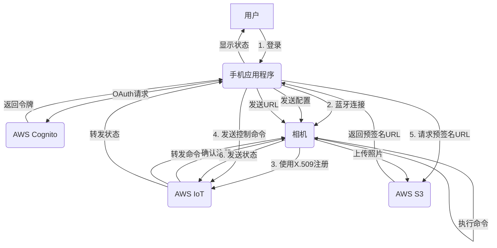

## Devicelink directly upload

### Camera, App, AWS ioT core collabration working flow:
#### Q: 
- 假定我有一个相机， 相机和手机APP 通过蓝牙连接， 手机使用AWS Cognito oauth 认证并控制相机向AWS IoT注册,   同时使用 MQTT通过证书（如 X.509）连接到AWS IoT,  同时相机还能通过手机APP 的控制将照片直接使用预签名 URL上传到AWS s3 bucket,  手机APP用来配合相机做oauth认证，请重新描述上面的认证过程和各个参与者的功能，以及相机和手机APP之间的控制信息以及交互的数据是什么，希望以流程图或表格形式清晰表达流程和数据交互

#### A: 
- 
- 
- 
- 
- 

