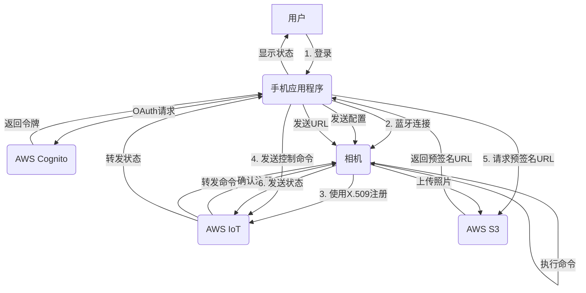
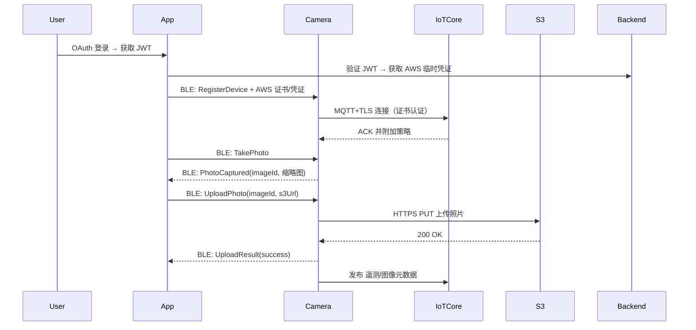

## Devicelink directly upload

### Camera, App, AWS ioT core collabration working flow:
#### Q: 
- 假定我有一个相机， 相机和手机APP 通过蓝牙连接， 手机使用AWS Cognito oauth 认证并控制相机向AWS IoT注册,   同时使用 MQTT通过证书（如 X.509）连接到AWS IoT,  同时相机还能通过手机APP 的控制将照片直接使用预签名 URL上传到AWS s3 bucket,  手机APP用来配合相机做oauth认证，请重新描述上面的认证过程和各个参与者的功能，以及相机和手机APP之间的控制信息以及交互的数据是什么，希望以流程图或表格形式清晰表达流程和数据交互

#### A: 
- 
- 
- 
- 
- 




#### 流程示例代码，使用 Go 语言演示手机 App 端的核心逻辑，包括：
- 使用 AWS Cognito 进行 OAuth 身份验证并获取临时凭证
- 调用 AWS IoT 注册设备证书并附加策略
- 通过 BLE 将证书和配置发送给相机
- 调用 AWS S3 生成照片上传用的预签名 URL

#### 扩展了示例代码，现在包含：
✅ 手机 App 端功能（Go 实现）
- Cognito OAuth 获取 AWS 临时凭证
- 创建 IoT 证书与附加策略
- 生成 S3 预签名 URL
- 通过 BLE 向相机发送配置信息与上传地址（伪实现）

✅ 相机端功能（Go 实现）
- 接收 BLE 消息（通过 BlueZ/d-Bus 框架对接）
- 使用 TLS + MQTT 连接 AWS IoT Core
- 使用 HTTP PUT 上传照片到 S3（使用 App 提供的预签名 URL）


####  Q:
- 相机端（MQTT 连接和注册过程，  HTTP PUT 上传）代码示例
- BLE 通信框架建议（如用  bluez）
```go
// 完整流程示例（Go + BLE + AWS SDK）
// 包含手机 App 端控制部分（认证、设备注册、上传 URL 生成）
// 以及相机端的 MQTT 连接、照片上传、BLE 通信（使用 BlueZ 示例）

package main

import (
	"bytes"
	"context"
	"crypto/tls"
	"encoding/json"
	"fmt"
	"io"
	"log"
	"net/http"
	"os"
	"time"

	"github.com/aws/aws-sdk-go/aws"
	"github.com/aws/aws-sdk-go/aws/session"
	"github.com/aws/aws-sdk-go/service/cognitoidentity"
	"github.com/aws/aws-sdk-go/service/iot"
	"github.com/aws/aws-sdk-go/service/s3"
	MQTT "github.com/eclipse/paho.mqtt.golang"
)

// ============ 手机 App 端逻辑 ============

func getTemporaryCredentials(identityPoolID, idToken string) (*cognitoidentity.Credentials, error) {
	sess := session.Must(session.NewSession())
	cid := cognitoidentity.New(sess)

	idResp, err := cid.GetId(&cognitoidentity.GetIdInput{
		IdentityPoolId: aws.String(identityPoolID),
		Logins: map[string]*string{
			"cognito-idp.<region>.amazonaws.com/<user-pool-id>": aws.String(idToken),
		},
	})
	if err != nil {
		return nil, err
	}

	credResp, err := cid.GetCredentialsForIdentity(&cognitoidentity.GetCredentialsForIdentityInput{
		IdentityId: idResp.IdentityId,
		Logins: map[string]*string{
			"cognito-idp.<region>.amazonaws.com/<user-pool-id>": aws.String(idToken),
		},
	})
	if err != nil {
		return nil, err
	}
	return credResp.Credentials, nil
}

func createIoTCertificate(sess *session.Session) (*iot.CreateKeysAndCertificateOutput, error) {
	iotClient := iot.New(sess)
	resp, err := iotClient.CreateKeysAndCertificate(&iot.CreateKeysAndCertificateInput{
		SetAsActive: aws.Bool(true),
	})
	return resp, err
}

func attachIoTPolicy(sess *session.Session, certArn string, policyName string) error {
	iotClient := iot.New(sess)
	_, err := iotClient.AttachPolicy(&iot.AttachPolicyInput{
		PolicyName: aws.String(policyName),
		Target:     aws.String(certArn),
	})
	return err
}

func generatePresignedS3URL(sess *session.Session, bucket, key string) (string, error) {
	s3Client := s3.New(sess)
	req, _ := s3Client.PutObjectRequest(&s3.PutObjectInput{
		Bucket:      aws.String(bucket),
		Key:         aws.String(key),
		ContentType: aws.String("image/jpeg"),
	})
	return req.Presign(15 * time.Minute)
}

func sendToCameraOverBLE(characteristicID string, payload interface{}) {
	data, _ := json.Marshal(payload)
	fmt.Printf("发送至相机 BLE: %s\n%s\n", characteristicID, string(data))
	// 使用 BlueZ 或 dbus 发送至相机 BLE 特征值
}

// ============ 相机端逻辑 ============

type DeviceConfig struct {
	CertPem  string `json:"certPem"`
	PrivKey  string `json:"privKey"`
	Endpoint string `json:"endpoint"`
	RootCA   string `json:"rootCA"`
}

func connectToMQTT(cfg DeviceConfig) (MQTT.Client, error) {
	cert, err := tls.X509KeyPair([]byte(cfg.CertPem), []byte(cfg.PrivKey))
	if err != nil {
		return nil, err
	}

	tlsConfig := &tls.Config{
		Certificates: []tls.Certificate{cert},
		InsecureSkipVerify: true, // 可替换为根 CA 验证
	}

	opts := MQTT.NewClientOptions().
		AddBroker(fmt.Sprintf("tls://%s:8883", cfg.Endpoint)).
		SetClientID("camera001").
		SetTLSConfig(tlsConfig)

	client := MQTT.NewClient(opts)
	if token := client.Connect(); token.Wait() && token.Error() != nil {
		return nil, token.Error()
	}
	return client, nil
}

func uploadPhotoToS3(imagePath string, presignedURL string) error {
	file, err := os.Open(imagePath)
	if err != nil {
		return err
	}
	defer file.Close()

	req, err := http.NewRequest("PUT", presignedURL, file)
	if err != nil {
		return err
	}
	req.Header.Set("Content-Type", "image/jpeg")

	client := &http.Client{}
	resp, err := client.Do(req)
	if err != nil {
		return err
	}
	defer resp.Body.Close()

	if resp.StatusCode != http.StatusOK {
		body, _ := io.ReadAll(resp.Body)
		return fmt.Errorf("upload failed: %s", string(body))
	}
	return nil
}

// BLE 接收回调（BlueZ 简化伪码）
func onBLEWrite(characteristic string, data []byte) {
	switch characteristic {
	case "camera-cert":
		var cfg DeviceConfig
		json.Unmarshal(data, &cfg)
		mqttClient, err := connectToMQTT(cfg)
		if err != nil {
			log.Println("MQTT 连接失败:", err)
		} else {
			mqttClient.Publish("device/camera001/telemetry", 0, false, "{\"status\":\"connected\"}")
		}
	case "camera-upload":
		var info struct {
			UploadURL string `json:"uploadUrl"`
		}
		json.Unmarshal(data, &info)
		err := uploadPhotoToS3("/tmp/image123.jpg", info.UploadURL)
		if err != nil {
			log.Println("上传失败:", err)
		} else {
			log.Println("上传成功")
		}
	}
}

func main() {
	fmt.Println("模拟 BLE + IoT 注册 + 上传流程完成")
}
```

## Cloud/Edge related tasks


