## Devicelink directly upload

### Camera, App, AWS ioT core collabration working flow:
#### Q: 
- 假定我有一个相机， 相机和手机APP 通过蓝牙连接， 手机使用AWS Cognito oauth 认证并控制相机向AWS IoT注册,   同时使用 MQTT通过证书（如 X.509）连接到AWS IoT,  同时相机还能通过手机APP 的控制将照片直接使用预签名 URL上传到AWS s3 bucket,  手机APP用来配合相机做oauth认证，请重新描述上面的认证过程和各个参与者的功能，以及相机和手机APP之间的控制信息以及交互的数据是什么，希望以流程图或表格形式清晰表达流程和数据交互

#### A: 
- 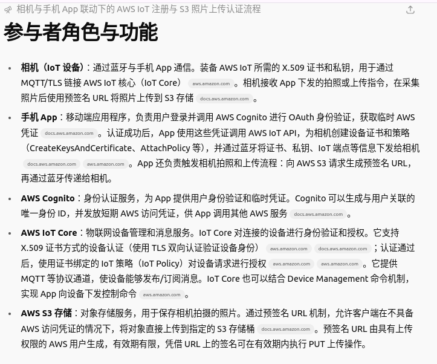
- 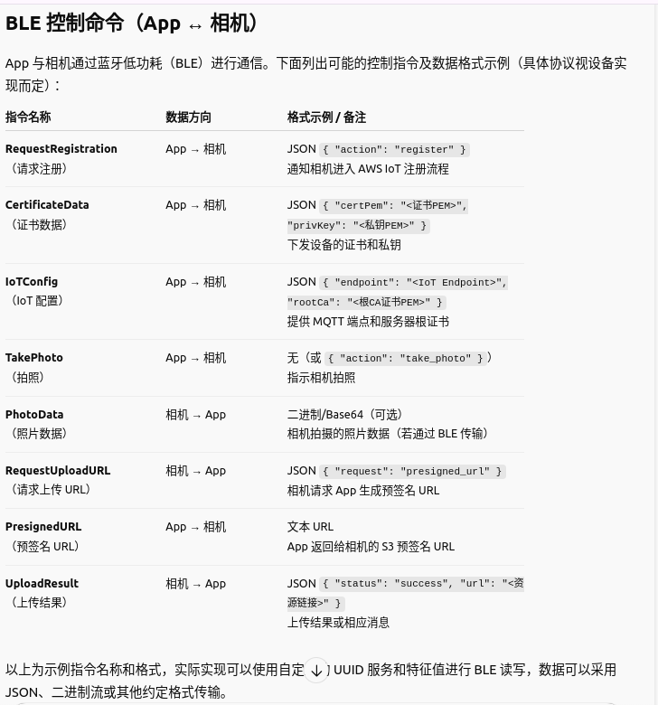
- 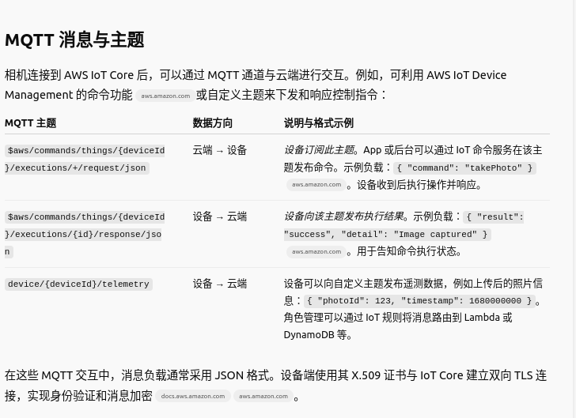
- 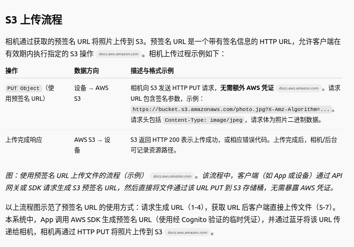
- 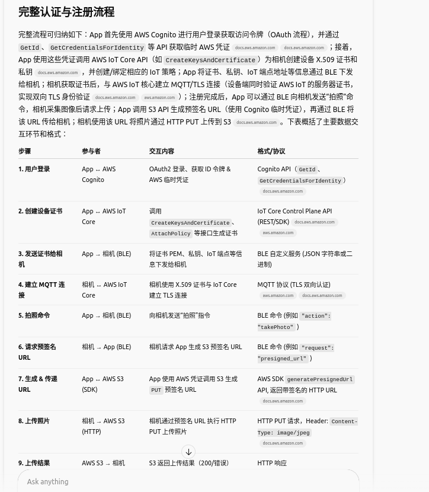

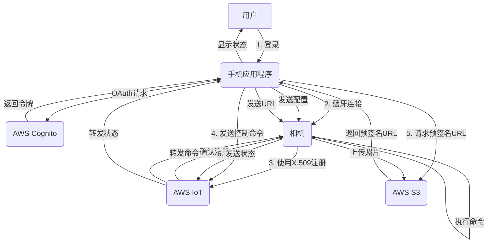
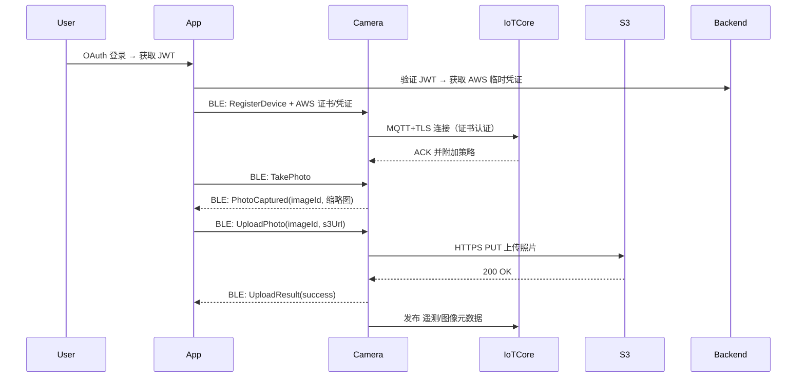

#### 流程示例代码，使用 Go 语言演示手机 App 端的核心逻辑，包括：
- 使用 AWS Cognito 进行 OAuth 身份验证并获取临时凭证
- 调用 AWS IoT 注册设备证书并附加策略
- 通过 BLE 将证书和配置发送给相机
- 调用 AWS S3 生成照片上传用的预签名 URL

#### 扩展了示例代码，现在包含：
✅ 手机 App 端功能（Go 实现）
- Cognito OAuth 获取 AWS 临时凭证
- 创建 IoT 证书与附加策略
- 生成 S3 预签名 URL
- 通过 BLE 向相机发送配置信息与上传地址（伪实现）

✅ 相机端功能（Go 实现）
- 接收 BLE 消息（通过 BlueZ/d-Bus 框架对接）
- 使用 TLS + MQTT 连接 AWS IoT Core
- 使用 HTTP PUT 上传照片到 S3（使用 App 提供的预签名 URL）


####  Q:
- 相机端（MQTT 连接和注册过程，  HTTP PUT 上传）代码示例
- BLE 通信框架建议（如用  bluez）
```go
// 完整流程示例（Go + BLE + AWS SDK）
// 包含手机 App 端控制部分（认证、设备注册、上传 URL 生成）
// 以及相机端的 MQTT 连接、照片上传、BLE 通信（使用 BlueZ 示例）

package main

import (
	"bytes"
	"context"
	"crypto/tls"
	"encoding/json"
	"fmt"
	"io"
	"log"
	"net/http"
	"os"
	"time"

	"github.com/aws/aws-sdk-go/aws"
	"github.com/aws/aws-sdk-go/aws/session"
	"github.com/aws/aws-sdk-go/service/cognitoidentity"
	"github.com/aws/aws-sdk-go/service/iot"
	"github.com/aws/aws-sdk-go/service/s3"
	MQTT "github.com/eclipse/paho.mqtt.golang"
)

// ============ 手机 App 端逻辑 ============

func getTemporaryCredentials(identityPoolID, idToken string) (*cognitoidentity.Credentials, error) {
	sess := session.Must(session.NewSession())
	cid := cognitoidentity.New(sess)

	idResp, err := cid.GetId(&cognitoidentity.GetIdInput{
		IdentityPoolId: aws.String(identityPoolID),
		Logins: map[string]*string{
			"cognito-idp.<region>.amazonaws.com/<user-pool-id>": aws.String(idToken),
		},
	})
	if err != nil {
		return nil, err
	}

	credResp, err := cid.GetCredentialsForIdentity(&cognitoidentity.GetCredentialsForIdentityInput{
		IdentityId: idResp.IdentityId,
		Logins: map[string]*string{
			"cognito-idp.<region>.amazonaws.com/<user-pool-id>": aws.String(idToken),
		},
	})
	if err != nil {
		return nil, err
	}
	return credResp.Credentials, nil
}

func createIoTCertificate(sess *session.Session) (*iot.CreateKeysAndCertificateOutput, error) {
	iotClient := iot.New(sess)
	resp, err := iotClient.CreateKeysAndCertificate(&iot.CreateKeysAndCertificateInput{
		SetAsActive: aws.Bool(true),
	})
	return resp, err
}

func attachIoTPolicy(sess *session.Session, certArn string, policyName string) error {
	iotClient := iot.New(sess)
	_, err := iotClient.AttachPolicy(&iot.AttachPolicyInput{
		PolicyName: aws.String(policyName),
		Target:     aws.String(certArn),
	})
	return err
}

func generatePresignedS3URL(sess *session.Session, bucket, key string) (string, error) {
	s3Client := s3.New(sess)
	req, _ := s3Client.PutObjectRequest(&s3.PutObjectInput{
		Bucket:      aws.String(bucket),
		Key:         aws.String(key),
		ContentType: aws.String("image/jpeg"),
	})
	return req.Presign(15 * time.Minute)
}

func sendToCameraOverBLE(characteristicID string, payload interface{}) {
	data, _ := json.Marshal(payload)
	fmt.Printf("发送至相机 BLE: %s\n%s\n", characteristicID, string(data))
	// 使用 BlueZ 或 dbus 发送至相机 BLE 特征值
}

// ============ 相机端逻辑 ============

type DeviceConfig struct {
	CertPem  string `json:"certPem"`
	PrivKey  string `json:"privKey"`
	Endpoint string `json:"endpoint"`
	RootCA   string `json:"rootCA"`
}

func connectToMQTT(cfg DeviceConfig) (MQTT.Client, error) {
	cert, err := tls.X509KeyPair([]byte(cfg.CertPem), []byte(cfg.PrivKey))
	if err != nil {
		return nil, err
	}

	tlsConfig := &tls.Config{
		Certificates: []tls.Certificate{cert},
		InsecureSkipVerify: true, // 可替换为根 CA 验证
	}

	opts := MQTT.NewClientOptions().
		AddBroker(fmt.Sprintf("tls://%s:8883", cfg.Endpoint)).
		SetClientID("camera001").
		SetTLSConfig(tlsConfig)

	client := MQTT.NewClient(opts)
	if token := client.Connect(); token.Wait() && token.Error() != nil {
		return nil, token.Error()
	}
	return client, nil
}

func uploadPhotoToS3(imagePath string, presignedURL string) error {
	file, err := os.Open(imagePath)
	if err != nil {
		return err
	}
	defer file.Close()

	req, err := http.NewRequest("PUT", presignedURL, file)
	if err != nil {
		return err
	}
	req.Header.Set("Content-Type", "image/jpeg")

	client := &http.Client{}
	resp, err := client.Do(req)
	if err != nil {
		return err
	}
	defer resp.Body.Close()

	if resp.StatusCode != http.StatusOK {
		body, _ := io.ReadAll(resp.Body)
		return fmt.Errorf("upload failed: %s", string(body))
	}
	return nil
}

// BLE 接收回调（BlueZ 简化伪码）
func onBLEWrite(characteristic string, data []byte) {
	switch characteristic {
	case "camera-cert":
		var cfg DeviceConfig
		json.Unmarshal(data, &cfg)
		mqttClient, err := connectToMQTT(cfg)
		if err != nil {
			log.Println("MQTT 连接失败:", err)
		} else {
			mqttClient.Publish("device/camera001/telemetry", 0, false, "{\"status\":\"connected\"}")
		}
	case "camera-upload":
		var info struct {
			UploadURL string `json:"uploadUrl"`
		}
		json.Unmarshal(data, &info)
		err := uploadPhotoToS3("/tmp/image123.jpg", info.UploadURL)
		if err != nil {
			log.Println("上传失败:", err)
		} else {
			log.Println("上传成功")
		}
	}
}

func main() {
	fmt.Println("模拟 BLE + IoT 注册 + 上传流程完成")
}
```

## 过程 
### 1. 各参与者及其职责
| 参与者              | 职责                                                                                                                                               |
| :---------------- | :-------------------------------------------------------------------------------------------------------------------------------------------- |
| **手机 App**       | • 执行用户的 OAuth 登录（例如 Cognito/User Pool）<br>• 获取临时 AWS 凭证或 AWS IoT 证书<br>• 通过 BLE 向相机发送“注册”命令和 AWS 凭证<br>• 发送控制命令（如“拍照”、“上传照片”）给相机                 |
| **相机**           | • 与手机 App 保持 BLE 连接<br>• 接收 AWS IoT 凭证和预配命令<br>• 使用 MQTT（TLS 双向认证）连接 AWS IoT Core<br>• 发布遥测/状态信息到 MQTT 主题<br>• 在 BLE 命令下拍照并使用临时凭证或预签名 URL 上传到 S3 |
| **AWS IoT Core** | • 签发或验证 X.509 证书（通过 JITR 等）<br>• 提供 MQTT 接入端点<br>• 根据 IoT 策略控制设备的发布/订阅权限                                                                         |
| **AWS S3**       | • 存储照片文件<br>• 通过预签名 URL 或临时 STS 凭证授予上传权限                                                                                                         |

### 2. 高级认证与预配流程
用户登录 (OAuth)

- 用户在手机 App 中通过 OAuth 2.0（如 Cognito 用户池）登录。

- App 获取访问令牌（JWT）及刷新令牌。

获取 AWS 临时凭证

- App 将 JWT 发给后端服务或直接调用 AWS STS。

- 后端验证令牌后，返回具备 IoT 和 S3 权限的临时凭证（AccessKey/SecretKey/SessionToken）。

通过 BLE 预配相机

- App 与相机建立 BLE GATT 连接。

- App 发送 “RegisterDevice” 命令，附带：

  - 相机唯一 ID（如序列号或 MAC）

  - AWS IoT 证书或证书签名请求（CSR）

  - 临时 AWS 凭证 或 用于获取证书的预签名 URL

  - 相机将这些信息写入自身安全存储。

IoT Core 设备注册

- 相机使用新获取的证书，发起 MQTT+TLS 握手连接到 AWS IoT。

- IoT Core 验证证书（CA 链或 JITR），成功后将对应的 IoT 策略附加到该设备。

相机的 MQTT 连接

- 相机连接到 mqtts://<your-iot-endpoint>:8883。

- 订阅 control/camera/{deviceId}/# 主题以接收远端命令。

- 发布到 telemetry/camera/{deviceId}/status 和 telemetry/camera/{deviceId}/imageMeta 主题。


### 3. 控制命令与数据交互
A. 手机 App → 相机（通过 BLE）
| 命令              | 示例载荷                             | 说明             |
| :--------------- | :---------------------------------- | :-------------- |
| **RegisterDevice**   | `{ deviceId, certPem, privateKeyPem }`  | 为相机做 AWS IoT 预配 |
| **TakePhoto**        | `{ resolution: "12MP", format: "jpg" }` | 指示相机拍摄照片        |
| **UploadPhoto**      | `{ imageId, s3Url, awsCreds? }`         | 请求相机上传指定照片      |
| **ConfigureSetting** | `{ setting: "exposure", value: 1/60 }`  | 调整相机参数（如快门速度）   |

B. 相机 → 手机 App（通过 BLE）
| 消息                  | 示例载荷                  | 说明            |
| :------------ | :------------------------------ | :------------- |
| **ProvisionResult** | `{ success: true, error?: string }`   | 确认 AWS IoT 预配结果 |
| **PhotoCaptured**   | `{ imageId, timestamp, thumbnail }`   | 通知 App 照片已拍摄完成  |
| **UploadResult**    | `{ imageId, s3Url, success, error? }` | 报告 S3 上传结果      |
| **StatusUpdate**    | `{ battery: 80%, wifiSignal: 3 }`     | 周期性设备状态更新       |

C. 相机 → AWS IoT（通过 MQTT）
| 主题                                      | 载荷                      |
| :-------------------------------------- | :------------------------- |
| `telemetry/camera/{deviceId}/status`    | `{ battery: 80, temperature: 25.1 }`      |
| `telemetry/camera/{deviceId}/imageMeta` | `{ imageId, size: 3.4MB, format: "jpg" }` |

- D. 手机 App → AWS S3（通过 HTTPS）
  - App 也可以使用同样的临时凭证或预签名 URL，直接将照片上传到 S3（例如用于预览）。
 

## Grok answer
### Role & function

- 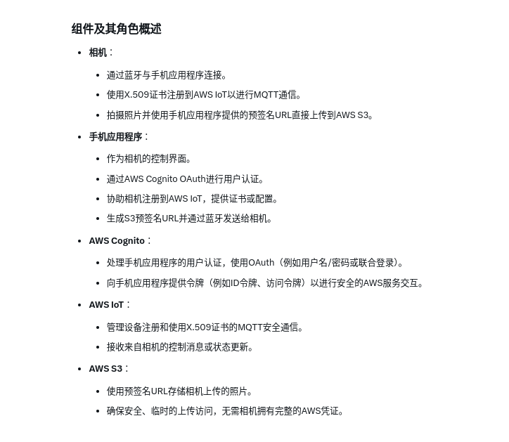
- 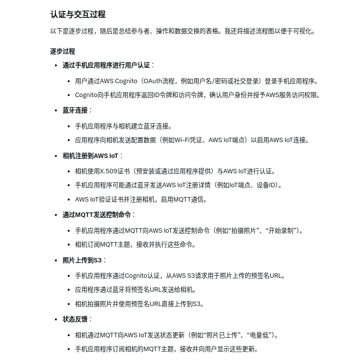
- 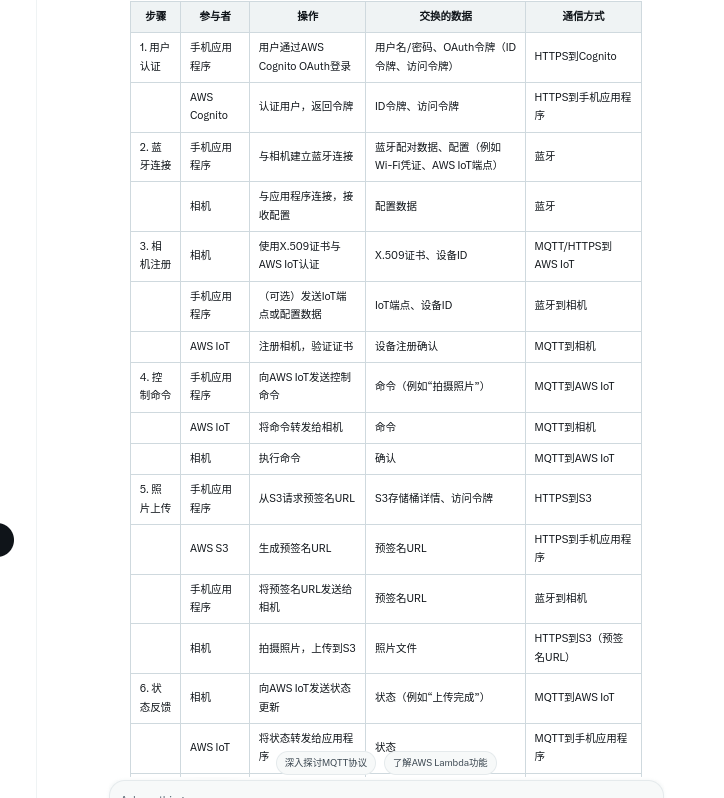
- 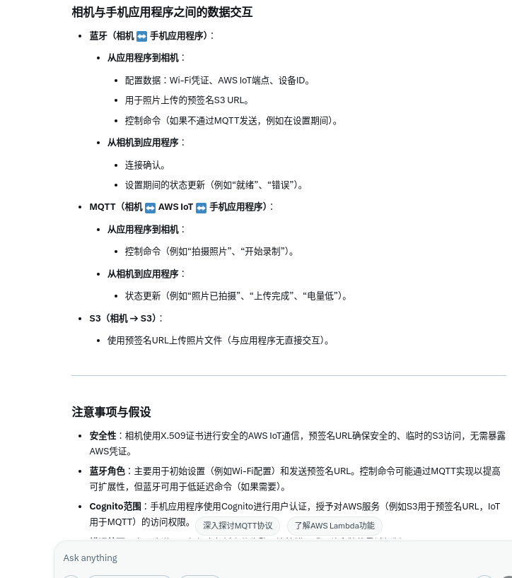

### 认证注册部分的详细分解 

#### 1. 认证注册部分的详细分解认证注册过程涉及相机通过X.509证书与AWS IoT建立安全连接，手机应用程序通过蓝牙提供必要的配置数据，而AWS Cognito为手机应用程序的用户认证提供支持。以下是详细步骤：
步骤分解
##### 步骤 1.1：用户通过手机应用程序认证（AWS Cognito）参与者：用户、手机应用程序、AWS Cognito
操作：
- 用户在手机应用程序中输入凭证（例如用户名/密码）或通过联合身份提供商（例如Google、Facebook）登录。
- 手机应用程序向AWS Cognito用户池发起OAuth 2.0授权码或隐式授权流程。
- Cognito验证凭证，生成ID令牌、访问令牌和（可选）刷新令牌。

数据交互：
- 输入：用户名/密码或联合登录令牌。
- 输出：ID令牌（用户身份）、访问令牌（服务访问权限）、刷新令牌（长期会话）。

通信方式：
- HTTPS（手机应用程序  AWS Cognito）。

目的：
- 为手机应用程序提供安全凭证，以便访问AWS服务（如AWS IoT和S3）。

##### 步骤 1.2：蓝牙配对与初始连接参与者：手机应用程序、相机
操作：
- 手机应用程序搜索并配对相机（假设相机已启用蓝牙并处于可发现模式）。
- 配对后，建立安全的蓝牙连接（例如使用BLE GATT协议）。
- 手机应用程序验证相机的身份（例如通过设备序列号或预共享密钥）。

数据交互：
- 输入：蓝牙配对请求。
- 输出：配对确认、相机设备信息（例如序列号、固件版本）。

通信方式：
- 蓝牙（BLE，经典蓝牙或自定义协议）。
- 目的：建立手机应用程序与相机之间的安全通信通道。

##### 步骤 1.3：相机配置与AWS IoT端点提供参与者：手机应用程序、相机
操作：
- 手机应用程序通过蓝牙向相机发送AWS IoT配置数据，包括：AWS IoT Core端点（例如your-iot-endpoint.iot.region.amazonaws.com）。
- 设备ID（唯一标识相机）。
- Wi-Fi凭证（SSID和密码，假设相机需要Wi-Fi连接到AWS IoT）。
- 相机接收并存储这些配置数据，用于后续与AWS IoT的连接。

数据交互：
- 输入：AWS IoT端点、设备ID、Wi-Fi凭证。
- 输出：相机确认接收配置（例如“配置成功”）。

通信方式：
- 蓝牙。

目的：
- 使相机能够连接到互联网并与AWS IoT通信。

##### 步骤 1.4：相机X.509证书准备参与者：相机、（可选）手机应用程序
操作：
- 相机需要一组X.509证书（私钥、公钥证书和CA证书）来与AWS IoT进行身份验证。
- 情况1：预安装证书：相机在出厂时已预装X.509证书（由制造商生成并注册到AWS IoT）。
  - 手机应用程序无需提供证书，仅需提供设备ID或策略信息。
- 情况2：动态证书生成：手机应用程序通过AWS IoT API（使用Cognito获取的访问令牌）调用CreateKeysAndCertificate生成证书。
  - **应用程序通过蓝牙将证书、私钥和CA证书传输到相机。**
- 相机验证并存储证书，确保私钥安全存储（例如在安全元素或加密存储中）。

数据交互：
- 输入（动态情况）：X.509证书、私钥、CA证书。
- 输出：相机确认证书存储成功。

通信方式：
- 蓝牙（动态情况）或无（预安装情况）。
目的：
- 为相机提供与AWS IoT进行安全MQTT通信的凭证。

##### 步骤 1.5：相机注册到AWS IoT参与者：相机、AWS IoT、（可选）手机应用程序
操作：
- 相机使用Wi-Fi连接到互联网，并通过MQTT（端口8883，TLS加密）连接到AWS IoT端点。
- 相机发送X.509证书进行身份验证，AWS IoT验证证书是否已注册并与设备策略关联。
- 如果未注册（动态情况）：手机应用程序通过AWS IoT API（使用Cognito凭证）调用RegisterThing或AttachPrincipalPolicy，将相机证书与AWS IoT策略关联。
- AWS IoT确认注册，相机订阅相关MQTT主题（例如device/<device-id>/commands）。

数据交互：
- 输入：X.509证书、设备ID、MQTT连接请求。
- 输出：注册确认、MQTT连接成功。

通信方式：
- MQTT（相机  AWS IoT）、HTTPS（手机应用程序  AWS IoT，动态情况）。
目的：
- 在AWS IoT中注册相机，建立安全的MQTT通信通道。

##### 步骤 1.6：验证注册成功参与者：相机、手机应用程序、AWS IoT
操作：
- 相机向AWS IoT发送测试消息（例如到主题device/<device-id>/status）。
- 手机应用程序订阅相同的MQTT主题，接收相机消息以确认连接。
- 应用程序向用户显示“相机已注册”或类似状态。

数据交互：
- 输入：测试消息（例如“设备在线”）。
- 输出：手机应用程序接收消息并确认。

通信方式：
- MQTT（相机  AWS IoT  手机应用程序）。
目的：
- 验证相机已成功注册并可以与手机应用程序通信。

#### 2. 验证设置的方法为确保上述认证注册设置可行，您可以按照以下步骤验证每个组件的功能和安全性。以下方法包括工具、配置检查和潜在问题排查。

验证步骤验证AWS Cognito用户认证
- 方法：
  - 使用AWS Management Console检查Cognito用户池配置，确保启用了OAuth 2.0（授权码或隐式授权）。
  - 在手机应用程序中模拟用户登录，捕获HTTPS请求（使用工具如Postman或Wireshark）以验证令牌响应。

- 工具：
  - AWS Console、Postman、Wireshark。
  - 预期结果：手机应用程序收到有效的ID令牌和访问令牌。
  - 潜在问题：配置错误的客户端ID或范围。
  - 联合身份提供商未正确配置。

- 解决：
  - 检查Cognito用户池设置，确保应用程序客户端启用了正确的OAuth流程。

验证蓝牙连接方法：
- 使用蓝牙调试工具（例如nRF Connect或BlueZ）测试手机应用程序与相机之间的配对和数据传输。
- 验证相机是否正确接收Wi-Fi凭证和AWS IoT端点。

- 工具：
  - nRF Connect（iOS/Android）、BlueZ（Linux）、手机应用程序日志。
  - 预期结果：相机确认接收配置数据，日志显示成功配对。
  - 潜在问题：蓝牙版本不兼容（例如BLE 5.0 vs 4.0）。
  - 配对失败或数据传输中断。

- 解决：
  - 确保相机和手机支持相同的蓝牙协议，检查信号干扰。

验证X.509证书和AWS IoT注册方法：
- 检查AWS IoT控制台中的“Things”列表，确认相机设备已注册。
- 使用AWS CLI运行aws iot list-things和aws iot list-certificates检查设备和证书状态。
- 模拟相机MQTT连接，使用工具如Mosquitto客户端测试连接到AWS IoT端点。

- 工具：
  - AWS CLI、Mosquitto、AWS IoT Console。

- 预期结果：
  - 相机设备在AWS IoT中列出，证书状态为“ACTIVE”。
  - 相机成功连接到MQTT端点（端口8883，TLS）。

- 潜在问题：
  - 证书未注册或与策略未关联。
  - 相机无法连接到Wi-Fi或AWS IoT端点。

- 解决：
  - 确保证书已通过AttachPrincipalPolicy与IoT策略关联。
  - 检查Wi-Fi凭证和网络连接。

验证MQTT通信方法：
- 使用AWS IoT Console的MQTT客户端测试工具订阅相机主题（例如device/<device-id>/status）。
- 从手机应用程序发送测试命令，验证相机是否响应。

- 工具：
  - AWS IoT Console、Mosquitto。
  - 预期结果：
    - 相机接收命令并发送状态更新，手机应用程序接收到消息。
  - 潜在问题：
    - MQTT主题配置错误。
    - 相机未订阅正确主题。

- 解决：
  - 检查AWS IoT策略，确保证书允许发布/订阅相关主题。

整体集成测试方法：执行端到端测试：
- 用户登录 → 蓝牙连接 → 相机注册 → 发送控制命令 → 验证MQTT消息。
- 使用日志（手机应用程序、相机固件、AWS CloudWatch）监控每个步骤。

- 工具：
  - AWS CloudWatch、手机应用程序调试日志、相机固件日志。
  - 预期结果：
    - 所有步骤按预期完成，相机注册并响应命令。
  - 潜在问题：
    - 任何步骤失败（例如证书无效、蓝牙断开）。
  - 解决：
    - 逐个调试失败步骤，检查日志以定位问题。

AWS服务配置检查Cognito：
- 用户池已启用OAuth 2.0，范围包括aws.cognito.signin.user.admin和iot:Publish。
- 应用程序客户端配置了正确的回调URL。

AWS IoT：
- IoT策略允许iot:Connect、iot:Publish、iot:Subscribe等操作。
- 证书已注册并附加到策略。

网络：
- 相机支持TLS 1.2或更高版本，兼容AWS IoT的MQTT要求。
- Wi-Fi网络允许端口8883（MQTT over TLS）。

- 推荐工具AWS CLI：
  - 用于查询IoT设备、证书和策略。
- Mosquitto：
  - 测试MQTT连接和消息。
- nRF Connect：
  - 调试蓝牙通信。
- AWS CloudWatch：
  - 监控IoT日志和Cognito事件。

#### 3. 表格和流程图更新

- 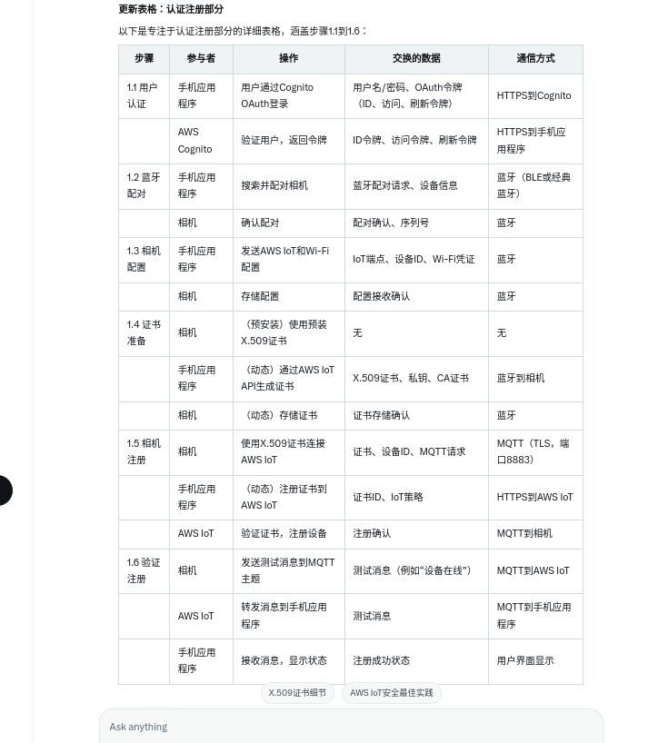

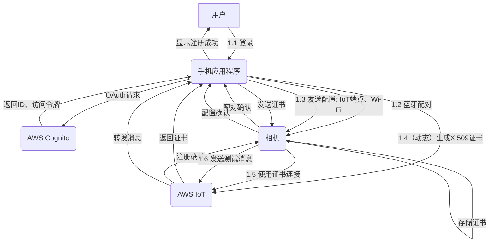
流程图说明：
- 增加了证书准备（预安装或动态）和测试消息步骤。
- 强调了蓝牙在配置和证书传输中的角色。
- 显示了AWS IoT的证书验证和MQTT连接过程。

补充说明
- 安全性注意事项：
  - X.509证书的私钥必须在相机上安全存储（例如使用硬件安全模块）。
  - 蓝牙通信应加密（例如BLE的加密配对）。
  - AWS IoT策略应遵循最小权限原则，仅允许必要的MQTT操作。

- 动态证书 vs 预安装证书：
  - 动态证书适合灵活部署，但增加手机应用程序的复杂性。
  - 预安装证书简化流程，但需要制造商与AWS IoT集成。

- 验证中的潜在挑战：
  - 相机固件可能不支持TLS 1.2或特定加密算法。
  - 蓝牙传输大证书文件可能因带宽限制而失败。
  - AWS IoT策略配置错误可能导致连接失败。
