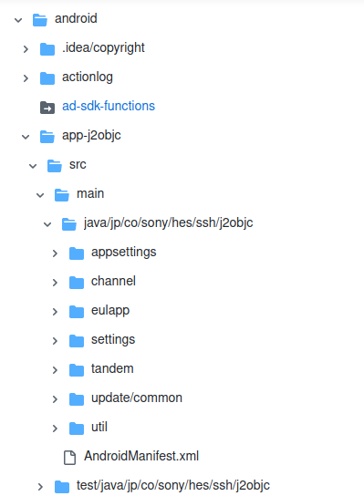
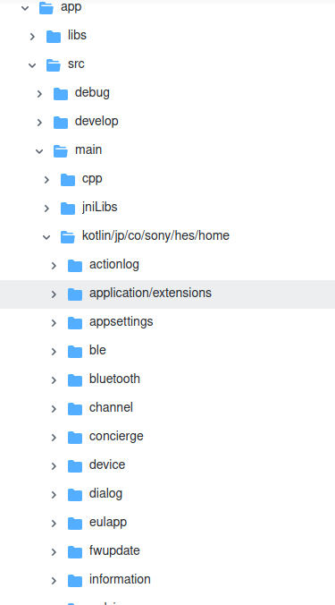
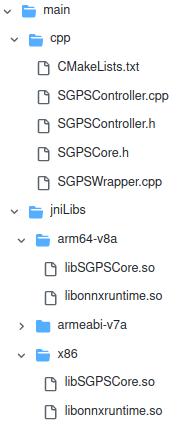
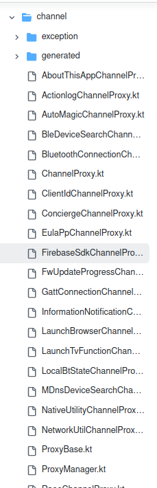
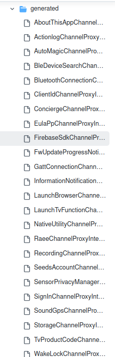

---
### Knowledge MUST
- flutter / Dart / ArkUI / Java / Kotlin
- gitee.com/openharmony/flutter-flutter -b ohos
- HarmonyOS SDK /NDK 开发
- HarmonyOS micro-kernel
- android Jni
- DevEco Studio NEXT IDE
- BCA project learning & analysis (把需要适配到harmonyos的接口 和 JNI/kotlin native code中需要适配harmonyOS mircro-kernel 的部分pickup出来,重新写并适配）

---
### SSH architecture & directory 
#### フォルダ構成
本プロジェクトはBRAVIA Connectアプリと関連ツールを含むモノレポジトリとして構成されています。
推奨リポジトリフォルダ構成は以下の通りです。
※実際のリポジトリ構成とは異なる可能性があります。適宜リファクタリングすることでフォルダ構成を整理してください。

```text
ssh-app
├── apps
│   ├── app                   # メインアプリケーション
│   │   ├── android           # Android固有の設定やコード <-- this the fold related with android platform
│   │   ├── assets            # アプリで使用する画像やフォントなどの静的リソース
│   │   ├── assets_overrides  # 次期バージョン向け静的リソースのオーバーライド用ディレクトリ
│   │   ├── env               # flutterのビルド用環境設定ファイル
│   │   ├── ios               # iOS固有の設定やコード
│   │   ├── lib               # アプリケーションの主要なソースコード
│   │   │   ├── l10n          # ローカライズ関連のファイル
│   │   │   └── src           # アプリの主要な機能を実装
│   │   │       ├── channel   # プラットフォームチャネル関連のコード
│   │   │       ├── constant  # 定数を定義
│   │   │       ├── exception # 例外処理関連のコード
│   │   │       ├── extension # 拡張メソッドを定義
│   │   │       ├── feature   # 各機能ごとのディレクトリ
│   │   │           └── <feature_name> # 特定の機能に関連するコード
│   │   │               ├── repository # データ取得・保存のロジック
│   │   │               ├── usecase    # ビジネスロジック
│   │   │               └── widget     # 機能固有のUIコンポーネント
│   │   │       ├── repository        # 共通のデータ取得・保存ロジック
│   │   │       ├── usecase           # 共通のビジネスロジック
│   │   │       └── view              # 各ページのUIとViewModel
│   │   │           └── <page_name>   # 特定のページに関連するコード
│   │   │               ├── <page_name>_page.dart      # ページのUI
│   │   │               └── <page_name>_viewmodel.dart # ページの状態管理
│   │   ├── pigeon            # Pigeonを使用したコード生成関連
│   │   └── test              # テストコード
│   │       ├── golden_test   # ゴールデンテスト用のファイル
│   │       └── src           # 各レイヤーのテストコード
│   └── ui_catalog            # UIカタログアプリケーション
├── docs                      # ドキュメント
├── keystore                  # キーストア関連のファイル
├── packages                  # 共通で使用するパッケージ実装
│   └── <package_name>        # 各パッケージのディレクトリ
├── resource                  # リソース関連のファイル
├── scripts                   # スクリプトファイル
└── tools                     # ツール(CLI)関連のコード
    └── <tool_name>           # 各ツールのディレクトリ
        ├── bin              # 実行可能ファイル
        ├── lib              # ツールのライブラリコード
        └── test             # ツールのテストコード
```

#### Explanation the Andoid platform related directory
```text
ssh-app
├── apps

.........  Android platform related include native library(Kotlin) & JNInative library (c/c++) 
│   ├── app                   # メインアプリケーション
│   │   ├── android           # Android固有の設定やコード <-- this the fold related with android platform

.........  Common used library include UI & logic (by flutter & dart) 
│   │   ├── lib               # アプリケーションの主要なソースコード
│   │   │   ├── l10n          # ローカライズ関連のファイル
│   │   │   └── src           # アプリの主要な機能を実装
│   │   │       ├── channel   # プラットフォームチャネル関連のコード  <--- Pigeon generated code for flutter communicate with Android native library (kotlin)
│   │   │       ├── constant  # 定数を定義
│   │   │       ├── exception # 例外処理関連のコード
│   │   │       ├── extension # 拡張メソッドを定義
│   │   │       ├── feature   # 各機能ごとのディレクトリ
│   │   │           └── <feature_name> # 特定の機能に関連するコード
│   │   │               ├── repository # データ取得・保存のロジック
│   │   │               ├── usecase    # ビジネスロジック
│   │   │               └── widget     # 機能固有のUIコンポーネント
│   │   │       ├── repository        # 共通のデータ取得・保存ロジック
│   │   │       ├── usecase           # 共通のビジネスロジック
│   │   │       └── view              # 各ページのUIとViewModel
│   │   │           └── <page_name>   # 特定のページに関連するコード
│   │   │               ├── <page_name>_page.dart      # ページのUI
│   │   │               └── <page_name>_viewmodel.dart # ページの状態管理

......... Pigeon generated code 
│   │   ├── pigeon            # Pigeonを使用したコード生成関連 
```
#### Sample Source code with `Kotlin android native layer`
##### Android native library with kotlin
https://github.com/csx-meta/ssh-app/blob/master/apps/app/android/app/src/main/kotlin/jp/co/sony/hes/home/ble/BleScanManager.kt
```java
///
// Copyright 2021 Sony Corporation
//
// クラスの説明 (日本語でOK)
//
///
package jp.co.sony.hes.home.ble

import android.bluetooth.BluetoothManager
import android.content.Context
import android.os.Handler
import android.os.Looper
import com.sony.songpal.ble.central.BleLocalNameListener
import com.sony.songpal.ble.central.ScanManagerInterface
import com.sony.songpal.ble.central.SonyAudioListener
import com.sony.songpal.ble.central.data.SonyAudio
import com.sony.songpal.ble.central.data.SonyAudioTandemOverBle
import com.sony.songpal.ble.central.data.SonyAudioVersion2
import com.sony.songpal.ble.central.param.audio.ModelId
import com.sony.songpal.ble.client.BleDevice
import com.sony.songpal.ble.client.BleDeviceCreator
import com.sony.songpal.ble.client.GattSwitcherAndroidFactory
import com.sony.songpal.util.SpLog
import jp.co.sony.hes.home.SshApplication
import jp.co.sony.hes.home.channel.BleDeviceSearchChannelProxy

typealias BleFoundListener = (device: BleDevice) -> Unit

class BleScanManager(private val scanManager: ScanManagerInterface) : SonyAudioListener, BleLocalNameListener {

    companion object {
        private val TAG = BleScanManager::class.java.simpleName
        private const val DELAY_STOP_SCAN_MSEC = 1000L
    }

    private val listeners = hashSetOf<BleFoundListener>()
    private var stopScanHandler: Handler? = null
    private var isScanning = false

    // [SSH-3106] Returns false if stopScanHandler is running
    fun isScanning() = isScanning && stopScanHandler == null

    fun start() {
        disposeStopScanHandler()
        if (isScanning || !isBtEnabled()) {
            return
        }
        scanManager.registerSonyAudioListener(this)
        scanManager.registerBleLocalNameListener(this)
        scanManager.startScan()
        isScanning = true
    }

    fun stop() {
        disposeStopScanHandler()
        stopScanHandler = Handler(Looper.getMainLooper())
        stopScanHandler!!.postDelayed({
            SpLog.d(TAG, "stopScanHandler fire")
            if (stopScanHandler == null) {
                SpLog.d(TAG, "Already disposed stopScanHandler")
                return@postDelayed
            }
            stopScanHandler = null
            scanManager.unregisterSonyAudioListener(this)
            scanManager.unregisterBleLocalNameListener(this)
            scanManager.stopScan()
            isScanning = false
        }, DELAY_STOP_SCAN_MSEC)
    }

    fun registerListener(listener: BleFoundListener) {
        synchronized(listeners) { listeners.add(listener) }
    }

    fun unregisterListener(listener: BleFoundListener) {
        synchronized(listeners) { listeners.remove(listener) }
    }
```

##### flutter use native library by android platform channel 
https://github.com/csx-meta/ssh-app/blob/master/apps/app/android/app/src/main/kotlin/jp/co/sony/hes/home/channel/LocalBtStateChannelProxy.kt

```java
///
// Copyright 2021 Sony Corporation
//
// クラスの説明 (日本語でOK)
//
///
package jp.co.sony.hes.home.channel

import android.app.Activity
import android.bluetooth.BluetoothAdapter
import android.bluetooth.BluetoothManager
import android.content.BroadcastReceiver
import android.content.Context
import android.content.Intent
import android.content.IntentFilter
import androidx.core.app.ActivityCompat
import io.flutter.embedding.android.FlutterFragmentActivity
import io.flutter.plugin.common.BinaryMessenger
import io.flutter.plugin.common.EventChannel
import io.flutter.plugin.common.MethodChannel
import jp.co.sony.hes.home.DeviceControlActivity
import jp.co.sony.hes.home.SshApplication
import jp.co.sony.hes.ssh.j2objc.channel.ChannelErrorCode

class LocalBtStateChannelProxy(application: SshApplication, binaryMessenger: BinaryMessenger)
    : ProxyBase(application), ChannelProxy {

    companion object {
        private val TAG = LocalBtStateChannelProxy::class.java.simpleName
        private const val REQUEST_ENABLE_BLUETOOTH = 1

        private fun getActivity(application: SshApplication?): FlutterFragmentActivity? {
            return application?.currentActivity as FlutterFragmentActivity?
        }
    }

    override val proxyClassName: String = "LocalBtStateChannelProxy"

    private val btActionFilter: IntentFilter = object : IntentFilter() {
        init {
            addAction(BluetoothAdapter.ACTION_STATE_CHANGED)
        }
    }

    private var btStateSink: EventChannel.EventSink? = null
    private var broadcastReceiver: BroadcastReceiver? = null

    init {
        EventChannel(binaryMessenger, "$eventChannelName/BtState")
                .setStreamHandler(object : EventChannel.StreamHandler {
                    override fun onListen(arguments: Any?, events: EventChannel.EventSink?) {
                        btStateSink = events
                    }

                    override fun onCancel(arguments: Any?) {
                        btStateSink = null
                    }
                })

        MethodChannel(binaryMessenger, methodChannelName)
                .setMethodCallHandler { call, result ->
                    when (call.method) {
                        "start" -> {
                            broadcastReceiver = object : BroadcastReceiver() {
                                override fun onReceive(context: Context, intent: Intent) {
                                    if (intent.action == BluetoothAdapter.ACTION_STATE_CHANGED) {
                                        if (intent.getIntExtra(BluetoothAdapter.EXTRA_STATE, BluetoothAdapter.STATE_OFF) == BluetoothAdapter.STATE_ON) {
                                            btStateSink?.success(true)
                                        } else if (intent.getIntExtra(BluetoothAdapter.EXTRA_STATE, BluetoothAdapter.STATE_OFF) == BluetoothAdapter.STATE_OFF) {
                                            btStateSink?.success(false)
                                        }
                                    }
                                }
                            }
                            weakApplication.get()?.registerReceiver(broadcastReceiver, btActionFilter)
                            val bm = weakApplication.get()?.getSystemService(Context.BLUETOOTH_SERVICE) as BluetoothManager?
                            val isEnabled = bm?.adapter?.isEnabled ?: false
                            btStateSink?.success(isEnabled)
                            result.success(null)
                        }
                        "stop" -> {
                            weakApplication.get()?.unregisterReceiver(broadcastReceiver)
                            broadcastReceiver = null
                            result.success(null)
                        }
                        "turnOn" -> {
                            val intent = Intent(BluetoothAdapter.ACTION_REQUEST_ENABLE)
                            val activity = getActivity(weakApplication.get())
                            if (activity is DeviceControlActivity) {
                                val listener = object : DeviceControlActivity.ActivityResultListener {
                                    override fun onActivityResult(requestCode: Int, resultCode: Int, data: Intent?) {
                                        if (requestCode != REQUEST_ENABLE_BLUETOOTH) {
                                            return
                                        }
                                        when (resultCode) {
                                            Activity.RESULT_OK -> result.success(null)
                                            Activity.RESULT_CANCELED -> result.error(
                                                ChannelErrorCode.REQUEST_BLUETOOTH_CANCELED,
                                                "Canceled by user",
                                                null
                                            )
                                            else -> result.error(
                                                ChannelErrorCode.REQUEST_BLUETOOTH_FAIL,
                                                "Unexpected result code",
                                                "resultCode = $resultCode"
                                            )
                                        }
                                        activity.unregisterActivityResultListener(this)
                                    }
                                }
                                activity.registerActivityResultListener(listener)
                                ActivityCompat.startActivityForResult(activity, intent, REQUEST_ENABLE_BLUETOOTH, null)
                            } else {
                                result.error(
                                    ChannelErrorCode.REQUEST_BLUETOOTH_FAIL,
                                    "Unexpected state",
                                    "failed to register result listener"
                                )
                            }
                        }
                        "isEnabled" -> {
                            val bm = weakApplication.get()?.getSystemService(Context.BLUETOOTH_SERVICE) as BluetoothManager?
                            val isEnabled = bm?.adapter?.isEnabled ?: false
                            result.success(isEnabled)
                        }
                    }
                }
    }

    override fun finalizeProxy() {
        if (broadcastReceiver != null) {
            try {
                weakApplication.get()?.unregisterReceiver(broadcastReceiver)
            } catch (e: IllegalArgumentException) {
                // nop
            }
        }
    }
}
```
##### pigeon autogenerated channle method calling source code
https://github.com/csx-meta/ssh-app/blob/master/apps/app/android/app/src/main/kotlin/jp/co/sony/hes/home/channel/generated/FirebaseSdkChannelProxyInterface.java

```java 
// Autogenerated from Pigeon (v13.0.0), do not edit directly.
// See also: https://pub.dev/packages/pigeon

package jp.co.sony.hes.home.channel.generated;

import android.util.Log;
import androidx.annotation.NonNull;
import androidx.annotation.Nullable;
import io.flutter.plugin.common.BasicMessageChannel;
import io.flutter.plugin.common.BinaryMessenger;
import io.flutter.plugin.common.MessageCodec;
import io.flutter.plugin.common.StandardMessageCodec;
import java.io.ByteArrayOutputStream;
import java.nio.ByteBuffer;
import java.util.ArrayList;
import java.util.Arrays;
import java.util.Collections;
import java.util.HashMap;
import java.util.List;
import java.util.Map;

/** Generated class from Pigeon. */
@SuppressWarnings({"unused", "unchecked", "CodeBlock2Expr", "RedundantSuppression", "serial"})
public class FirebaseSdkChannelProxyInterface {

  /** Error class for passing custom error details to Flutter via a thrown PlatformException. */
  public static class FlutterError extends RuntimeException {

    /** The error code. */
    public final String code;

    /** The error details. Must be a datatype supported by the api codec. */
    public final Object details;

    public FlutterError(@NonNull String code, @Nullable String message, @Nullable Object details) 
    {
      super(message);
      this.code = code;
      this.details = details;
    }
  }
.......
```

##### The layer of `SSH` program source code: 
- **Android native library & JNI:**
  - Native layer
  - `Kotlin & C/C++`
- **Common lib:**
  - upper layer
  - include UI & logic,
  - `flutter & dart`
- **Flutter communicate Native library:**
  - upperlayer should communicate with native layer to configure and use the actually hardware or android specific resources such as fragement and audio etc
  - Generated by Pigeon automatically to dart.
 
##### The android native library related parts:

- 

- 

- Android JNI
  - 

- Android native channel
  - 
 
- Androd native channel generated code
  - 

#### Workload
Except the flutter(upperlayer)
We should:
- Android native library --> HarmonyOS (Hardwork)
  - (android kotlin & C) --> Maybe `ArkTS`
  - Android hardware specific hw/resource --> Harmony OS
- pigeon auto generated channel:
  - Android platform channle --> maybe manually map to harmonyOS platform channel
- Commonlib:

#### Handling the Native Library
Your native library, written in Kotlin and using Android hardware and resources, poses a significant challenge. HarmonyOS does not support Android's native APIs directly, so you'll need to port it:
- Adapt the Native Library:
  - Kotlin native library, which uses Android hardware and resources, needs to be rewritten in ArkTS (HarmonyOS's TypeScript-based language).
  - This is a big task, as you'll need to learn HarmonyOS APIs and replace Android-specific calls.
- Kotlin to ArkTS Conversion:
  - HarmonyOS uses ArkTS, a TypeScript-based language, for native development. Kotlin maybe is supported on HarmonyOS via Huawei's ARK Compiler, but for native libraries, you'll likely need to rewrite in ArkTS.
  - This involves learning HarmonyOS APIs and replacing Android-specific calls, such as hardware access, with HarmonyOS equivalents. For example, if your library accesses camera APIs, you'll need to use HarmonyOS's camera APIs in ArkTS.
- Alternative Approach:
  - If common logic exists, abstract it and maintain separate implementations for Android (Kotlin) and HarmonyOS (ArkTS). This requires careful design to minimize code duplication.
- Challenges:
  - Highlights that porting native libraries is one of the hardest parts, especially if your library is complex or heavily tied to Android-specific features. You may need to consult HarmonyOS for Android Developers for guidance on API mappings.
 
#### Using Pigeon for Communication
Pigeon, a Flutter package for type-safe platform channel communication, is crucial for your setup. Research suggests it can be used on HarmonyOS, with specific adaptations:
- Pigeon on HarmonyOS:
  - Pigeon generates code for Android (Java/Kotlin) and iOS (Objective-C/Swift), and experimental support for other languages. For HarmonyOS, you'll need to generate code for ArkTS, as it's the native language.
- Challenges:
  - Ensuring Pigeon works seamlessly on HarmonyOS may require additional configuration, especially for type safety and channel adaptation. The research indicates some community efforts, like Flutter和OpenHarmony通信pigeon库的具体接入和用法, but documentation is sparse.
 

#### Challenges and Hard Parts
The porting process has several challenging aspects:
- Native Library Porting:
  - Rewriting the Kotlin native library in ArkTS is complex, especially if it relies on Android-specific hardware access. This requires learning new APIs and potentially redesigning parts of your app.
- Platform Channel Adaptation:
  - Adapting Pigeon for HarmonyOS, especially for ArkTS, can be tricky. Research shows issues like type conversion errors, requiring manual handling.
- Resource Management:
  - HarmonyOS has a different asset structure, so reorganizing resources (e.g., images, fonts) for HarmonyOS-specific directories is necessary.
- Learning Curve:
  - If you're new to HarmonyOS, understanding tools like DevEco Studio, hvigor, and ArkTS will take time. The research indicates a lack of comprehensive documentation for some aspects, especially for Pigeon on HarmonyOS.

Thinks:
- Rewriting the native library is likely the hardest part, as it involves learning new APIs and languages.
- Adapting platform channels (like Pigeon) for HarmonyOS can be tricky, especially if there are compatibility issues.
- Managing resources differently for HarmonyOS might take extra effort, and there's a learning curve with HarmonyOS tools.


   

